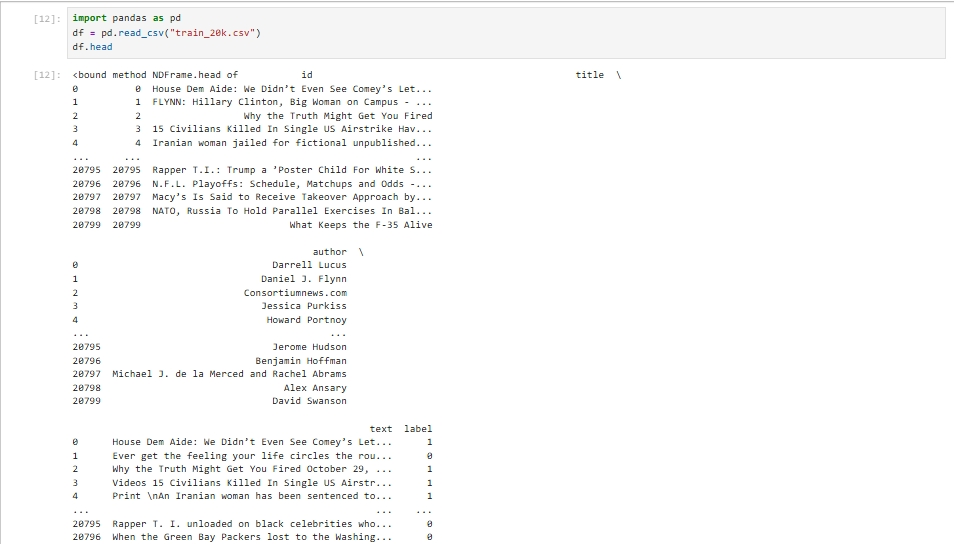

# 📰 Fake News Detector

🚀 **Project Submission for Iemhacks-3.0 2025**  
📍 *Iemhacks-3.0*

🔗 **Try the Live Project Here:** [Fake News Detector](https://iemhacks-30-2025-masuddar-rahaman.streamlit.app/)  


## 📌 About the Project

In an era of misinformation, this **AI-powered Fake News Detector** helps identify and prevent the spread of fake news using **Machine Learning and Natural Language Processing (NLP)**. The model leverages **Logistic Regression with TF-IDF vectorization** to classify news articles as **Real or Fake**.

## 📌 Video Demo  

### 🔴 Live Demo  [41 Second]
[](https://youtu.be/MmKO5bxPjMA)  
🎥 Watch the AI-powered Fake News Detector in action with real-time predictions and accuracy testing!  

### 🎯 Full Project Presentation  [04 Min 36 Sec]
[](https://youtu.be/LbZ4XBrdtMc)  
📊 A complete walkthrough of the project, covering its motivation, dataset, model training, and performance evaluation.  


## ⚡ Features
✅ **Machine Learning Model** (Logistic Regression with TF-IDF)  
✅ **Streamlit Web App** for easy access  
✅ **Real-Time Prediction** of fake news  
✅ **Interactive Data Visualization** for insights  
✅ **High Accuracy** (Achieved: **~{accuracy:.2f}%**)

## 🎯 Tech Stack
- **Python** 🐍
- **Streamlit** (Web App Framework) 🌐
- **scikit-learn** (Machine Learning) 🤖
- **NLTK** (Natural Language Processing) 📖
- **Pandas, NumPy** (Data Handling) 📊
- **Matplotlib** (Data Visualization) 📈

## 🏗️ How It Works
1. **Preprocessing**: Text cleaning, stemming (NLTK), stopword removal
2. **Feature Extraction**: TF-IDF vectorization of the news content
3. **Model Training**: Logistic Regression classifier on a labeled dataset
4. **Prediction**: User inputs a news article, and the model predicts its authenticity

## 🚀 Getting Started

### 🔹 Prerequisites
Make sure you have Python installed. Install the required dependencies using:
```bash
pip install -r requirements.txt
```

### 🔹 Run the App
```bash
streamlit run app.py
```

### 🔹 Usage
- Enter a news article in the text box.
- Click **Check News** to classify it as *Real* or *Fake*.

## 📊 Dataset Used
The model is trained on a dataset containing real and fake news articles with labels (0 = Real, 1 = Fake). The dataset includes author names, article titles, and content.

## 📌 Screenshots Data set overview
   
<br>
🌐 **Dataset Link:** [Kaggle Data used Link](https://www.kaggle.com/c/fake-news/data?select=train.csv)


## 👨‍💻 Team & Contributors
- **Masuddar Rahaman** - Sole Developer & AI Researcher 🎯


## 🤝 Connect & Support
📧 **Email:** masuddarrahaman31@gmail.com  <br>
🌐 **My Website:** [My Website Link](https://masuddar.in/)  <br>
🌐 **Portfolio:** [my portfolio link](https://masuddar.netlify.app/)    <br>
🔗 **LinkedIn:** [My LinkedIn Profile](https://www.linkedin.com/in/masuddar-rahaman-b5044b283/)
<br> 

# Thank you for your time

🚀 *"Fighting Fake News with AI!"*

